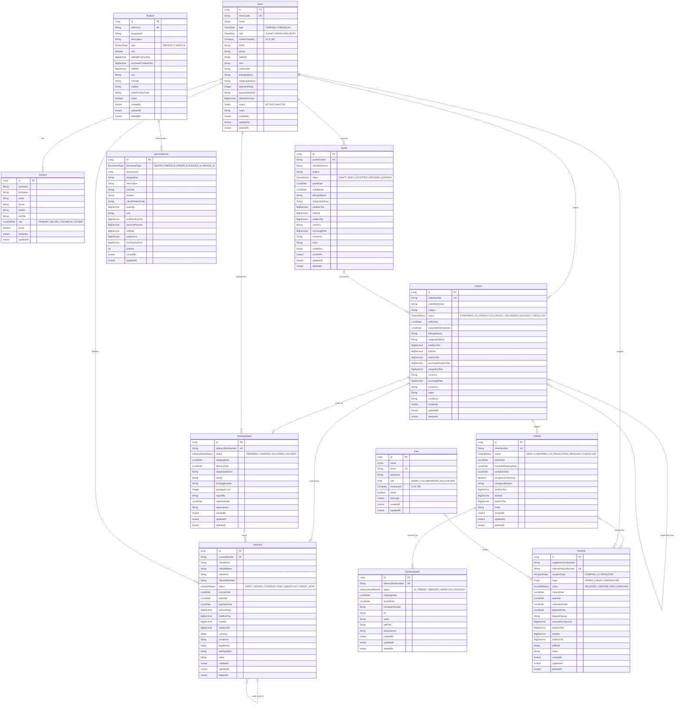

# Command Manager

Order/quote management system built with Vaadin + Spring Boot.

## Tech Stack

- Kotlin, Java 21
- Spring Boot, Vaadin
- Spring Data JPA + MySQL (H2 for tests)
- Gradle

## Getting Started

### Prerequisites

- Java 21+
- MySQL 8+

### Database Setup

```bash
mysql -u root -p -e "CREATE DATABASE IF NOT EXISTS command_manager;"
```

### Local Credentials

Create `src/main/resources/application-local.properties` (gitignored):

```properties
spring.datasource.password=yourpassword
```

### Run

```bash
./gradlew bootRun
```

The app starts at http://localhost:8080.

### Run Tests

```bash
./gradlew test
```

Tests run against an in-memory H2 database.

## ER Diagram



## Database Schema

Hibernate manages the schema automatically (`ddl-auto=update`). Modify JPA entities and restart.

To reset the schema from scratch (e.g. after renaming tables/columns):

```bash
mysql -u root -p -e "DROP DATABASE command_manager; CREATE DATABASE command_manager;"
```

Then temporarily set `spring.jpa.hibernate.ddl-auto=create` in `application.properties`, start the app, and switch back to `update`.

## Deployment

### Dev instance

A dev instance is automatically deployed to `http://178.104.157.63:8081` on every push to the `dev` branch via GitHub Actions.

## Building for Production

```bash
./gradlew bootJar -Pvaadin.productionMode=true
java -jar build/libs/command-manager-0.1.0.jar
```

Or build a Docker image:

```bash
docker build -t command-manager:latest .
```

Pass database credentials via environment variables:

```bash
SPRING_DATASOURCE_URL=jdbc:mysql://db-host:3306/command_manager \
SPRING_DATASOURCE_USERNAME=app_user \
SPRING_DATASOURCE_PASSWORD=s3cur3pass \
java -jar build/libs/command-manager-0.1.0.jar
```
